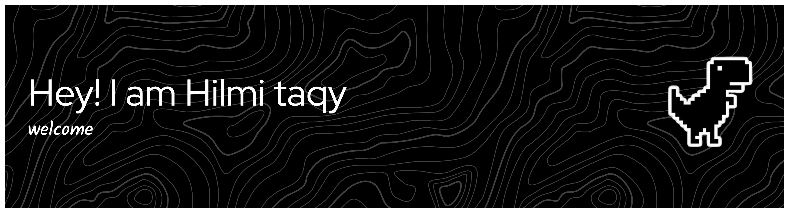

## Hi there 👋
**Hlmtqy/Hlmtqy** Hello, my name is Hilmi. I'm a front-end developer specializing in creating interactive and responsive websites using HTML, CSS, and JavaScript.

Here are some ideas to get you started:

## 👨‍💻 About me
🔭 I’m currently working on:
Learning and practicing basic front-end development.

🌱 I’m currently learning:
HTML, CSS, JavaScript, and basic UI design.

👯 I’m looking to collaborate on:
Small front-end or design-related projects to gain experience.

🤔 I’m looking for help with:
Understanding front-end concepts and improving my coding skills.

💬 Ask me about:
Basic front-end coding and simple web layouts.

⚡ Fun fact:
I’m a student who enjoys learning coding and design step by step 😊

## Tech Stack

- 
- 
- 

## 📱CONTACT WITH ME
- [instragam](https://www.instagram.com/hlmtqy_/)

